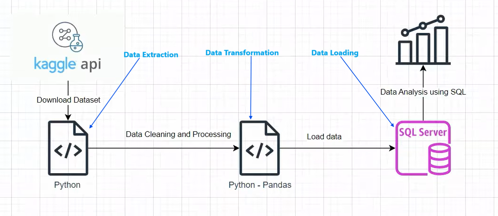

# Data-Analysis-Pipeline
This project demonstrates an end-to-end data analysis pipeline using ETL Operations: 
  
**Data Extraction**: Automated data download programmatically from Kaggle using a generated API token.  

**Data Transformation**: Processed raw data in Python(pandas) to remove duplicates and handle missing values. 

**Data Loading**: Established a connection between Python and SQL server using SQLALCHEMY & PYODBC Libraries then loaded the cleaned data into SQL Server for structured querying and analysis.  

**Data Analysis**: Conducted insights-driven analysis using SQL queries. saved in a reusable query file  

**Tools**: Python, SQL Server.  
**Libraries**: Numpy, Pandas, sqlalchemy, pyodbc, Kaggle API.  

#### Dataflow Architecture

